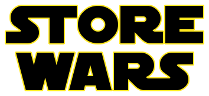
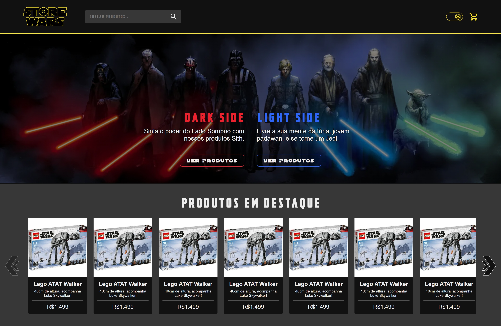

<h1 align="center">
  
</h1>

  <a href="#-tecnologias">Tecnologias</a>&nbsp;&nbsp;&nbsp;|&nbsp;&nbsp;&nbsp;
  <a href="#-projeto">Projeto</a>&nbsp;&nbsp;&nbsp;|&nbsp;&nbsp;&nbsp;
  <a href="#-como-executar">Como executar</a>

 

  

## 🧪 Tecnologias

Esse projeto foi desenvolvido com as seguintes tecnologias:

- [React](https://reactjs.org)
- [Next.js](https://nextjs.org)
- [TypeScript](https://www.typescriptlang.org)
- [Sass](https://sass-lang.com/)

## 💻 Projeto

<h4> Acesse em: https://store-wars.vercel.app </h4>

Este projeto FrontEnd é a idealização de uma loja virtual temática de Star Wars.

## 💣 Funcionalidades

- Tema dark e light
- Pesquisa de texto para encontrar produtos
- Filtragem de pesquisa por categoria e por preço
- Adicionar e remover produtos do carrinho
- Salva o tema e os produtos do carrinho no localStorage do navegador

## 🚀 Como executar

- Clone o repositório
- Instale as dependências com `yarn`
- Inicie o servidor com `yarn dev`

Agora você pode acessar [`localhost:1138`](http://localhost:1138) do seu navegador.

---

<h4 align="center"> Feito com ♥ por Marcelino Teixeira </h4>